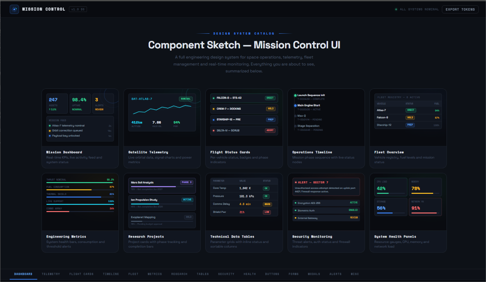
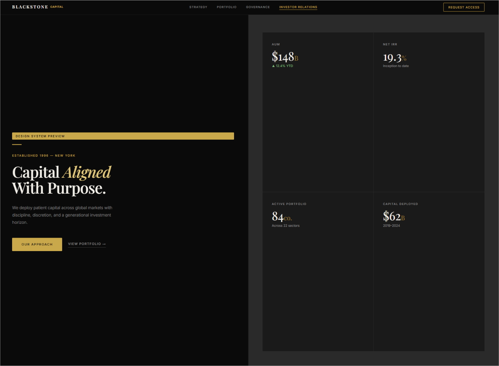
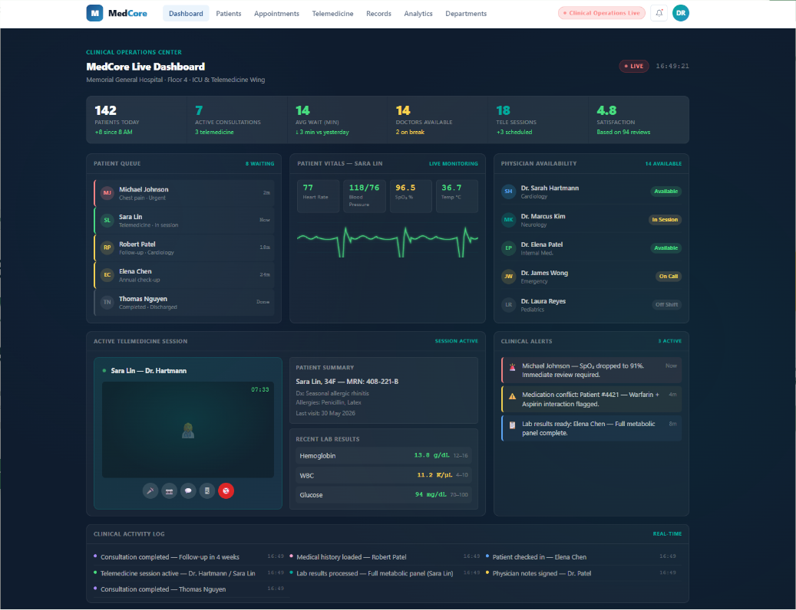
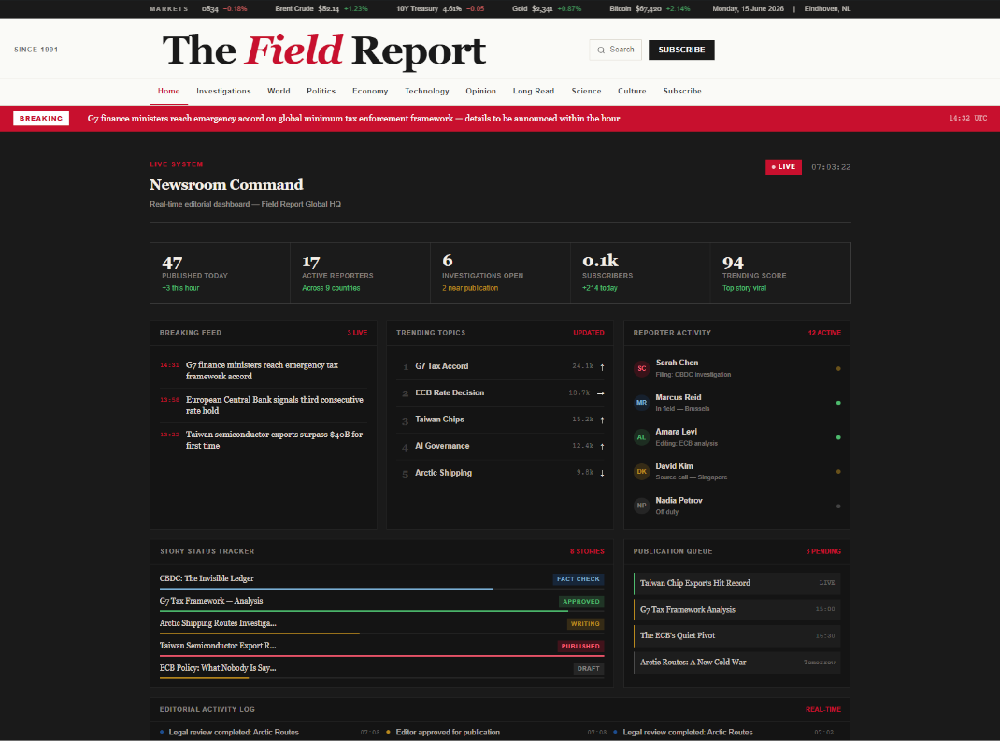
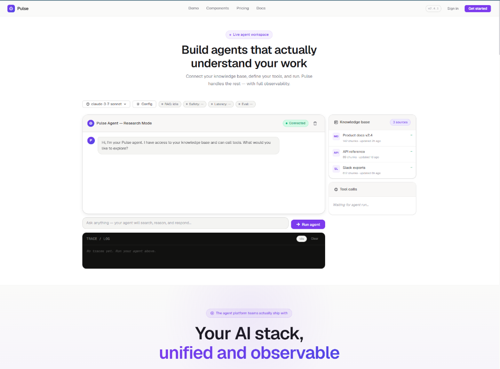

# Frontend Portfolio Aesthetic Store

A curated collection of reusable frontend aesthetics designed for both human developers and AI-assisted development workflows.

This repository is not simply a gallery of HTML templates. Each aesthetic acts as a fully executable visual reference that can be reused, analyzed, remixed, and extended by modern AI coding assistants such as Claude, GPT, Gemini, Qwen, Cursor, Windsurf, Continue, Cline, or other agentic development systems.

The goal is to provide high-quality frontend archetypes that serve as design anchors during generation. Instead of describing a visual style through long prompts, an AI can inspect one of these examples and immediately understand the intended visual language, component hierarchy, interaction patterns, spacing system, typography choices, and overall product personality.

Each HTML file is intentionally self-contained and includes:

* A complete visual identity
* Reusable UI patterns
* Interactive demonstrations
* Component showcases
* Production-inspired layouts
* Clear HTML, CSS, and JavaScript separation
* Portable architecture with no build process required

The collection spans multiple product categories and visual identities, including SaaS platforms, AI products, editorial publications, financial systems, community platforms, educational services, sustainability products, cybersecurity dashboards, aerospace operations, and industrial technology.

These examples can be used as:

* Design references
* Prompting references for AI systems
* Frontend inspiration libraries
* Rapid prototyping starting points
* Component extraction sources
* Visual benchmarking material
* Training examples for agentic development workflows

Each card in this repository references a PNG preview stored in `assets/` using the same base filename as its corresponding HTML file.

For maintenance procedures, repository conventions, and AI-agent handoff documentation, see [`AGENTS.md`](AGENTS.md).

When you prepare the preview images, save them with these names:

```text
assets/
  hrcomponent.png
  atlas.png
  blackstone.png
  forum.png
  lumex.png
  medcore.png
  newsroom.png
  nexusgrid.png
  pulse.png
  soltech_english.png
  talkingdutch.png
  verdant.png
```

## Featured Component

### HR Component


**File:** `hrcomponent.html`  
**Type:** SaaS / HR platform component system  
**Feel:** clean, professional, friendly, information-dense without feeling heavy  
**Best for:** dashboards, internal tools, HR, CRM, admin panels, SaaS products  
**Visual signature:** light surfaces, periwinkle blue, sage, lavender, soft radii, compact components, tables, toasts, modals, tabs, filters, and loading states.

---

## Aesthetic Catalog

### Atlas



**File:** `atlas.html`  
**Type:** Aerospace / robotics / defense / mission-control design system  
**Feel:** precise, mission-critical, engineered, operational, high-stakes  
**Best for:** aerospace platforms, satellite operations, robotics dashboards, defense systems, advanced engineering products  
**Visual signature:** deep navy surfaces, titanium-gray panels, technical status colors, blueprint-inspired grids, mono telemetry, mission dashboards, system health cards, fleet views, and instrument-panel interactions.

---

### Blackstone



**File:** `blackstone.html`  
**Type:** Premium executive finance / investment design system  
**Feel:** restrained, expensive, institutional, boardroom-ready  
**Best for:** private equity, wealth management, investor portals, executive dashboards, financial advisory sites  
**Visual signature:** charcoal surfaces, ivory typography, muted gold accents, Playfair Display headlines, thin dividers, formal cards, data panels, and high-trust financial UI patterns.

---

### ForoBardo


**File:** `forum.html`  
**Type:** Forum / community media platform component system  
**Feel:** loud, underground, opinionated, social, high-energy  
**Best for:** forums, creator communities, media feeds, social dashboards, content-heavy apps  
**Visual signature:** dark burnt surfaces, hot orange accents, condensed display type, mono metadata, chunky cards, post composers, media badges, modals, toasts, and forum-native interaction states.

---

### Lumex


**File:** `lumex.html`  
**Type:** Neon futurism / solar tech  
**Feel:** electric, nocturnal, energetic, premium tech  
**Best for:** energy, AI dashboards, crypto/fintech visuals, futuristic launches, motion-forward products  
**Visual signature:** dark background, neon purple/cyan, intense glow, particle canvas, marquee, luminous dashboards, and Exo 2 typography.

---

### MedCore



**File:** `medcore.html`  
**Type:** Healthcare / telemedicine / hospital operations design system  
**Feel:** trusted, clinical, calm, accessible, professional  
**Best for:** healthcare platforms, telemedicine products, hospital dashboards, patient portals, medical operations tools  
**Visual signature:** bright white and soft-gray surfaces, medical blues, teal accents, green health indicators, accessible spacing, appointment booking UI, doctor directories, patient dashboards, lab results, clinical timelines, and healthcare analytics.

---

### NexusGrid


**File:** `nexusgrid.html`  
**Type:** Cyberpunk / high-tech infrastructure  
**Feel:** classified, technical, militarized, alive as a system  
**Best for:** cybersecurity, cloud infrastructure, AI ops, devtools, enterprise edge platforms  
**Visual signature:** blue/cyan palette, scanlines, glitch text, holograms, terminals, telemetry, and distributed-network visual language.

---

### Newsroom



**File:** `newsroom.html`  
**Type:** Editorial / journalism / publishing design system  
**Feel:** credible, authoritative, investigative, refined, print-inspired  
**Best for:** newsrooms, long-form publications, research media, editorial products, intelligence reports  
**Visual signature:** warm paper surfaces, Georgia-style serif headlines, Helvetica-like UI text, thin editorial rules, red/amber/blue accent labels, multi-column story layouts, pull quotes, bylines, tickers, archives, and subscriber panels.

---

### Pulse



**File:** `pulse.html`  
**Type:** AI startup / agent platform / intelligent SaaS design system  
**Feel:** modern, crisp, intelligent, product-led, quietly technical  
**Best for:** AI agents, automation platforms, SaaS dashboards, workflow builders, model operations tools  
**Visual signature:** warm light surfaces, Geist typography, violet and mint accents, rounded product cards, agent status badges, dark log/code panels, workflow controls, and clean operational metrics.

---

### SolTech


**File:** `soltech_english.html`  
**Type:** Solar tech / clean industry  
**Feel:** warm, optimistic, commercial, energetic  
**Best for:** renewable energy, climatetech, solar hardware, B2B/B2C landing pages  
**Visual signature:** orange/yellow solar palette, commercial layouts, product blocks, performance indicators, and clear CTAs.

---

### TalkingDutch


**File:** `talkingdutch.html`  
**Type:** Institutional learning / Dutch language school  
**Feel:** sober, direct, educational, local  
**Best for:** education, tutors, online academies, personal professional services  
**Visual signature:** institutional dark theme, orange accents, Dutch flag motifs, video-call mockup, simple cards, and clear editorial hierarchy.

---

### Verdant


**File:** `verdant.html`  
**Type:** Organic sustainability / solar product  
**Feel:** natural, lightweight, trustworthy, soft premium  
**Best for:** sustainability, clean energy, wellness tech, eco products, B Corps  
**Visual signature:** greens, mint, paper-like surfaces, organic blobs, leaf particles, eco dashboard, and DM Sans/Playfair typography.

---

## Usage Notes

- This directory is meant to be moved as a complete package into other projects.
- The HTML files are full demos; the images in `assets/` act as a quick visual storefront.
- `debts.txt` is a working backlog for design ideas, missing concepts, and future aesthetic prompts.
- When adding new aesthetics, keep the same pattern: `name.html` + `assets/name.png` + one catalog card in this README.
- Keep `AGENTS.md` updated when the repository purpose, naming conventions, or maintenance workflow changes.
