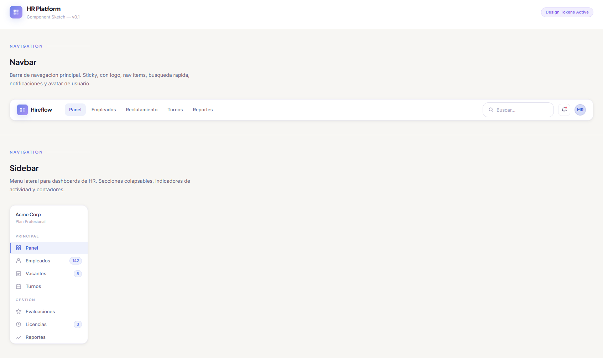
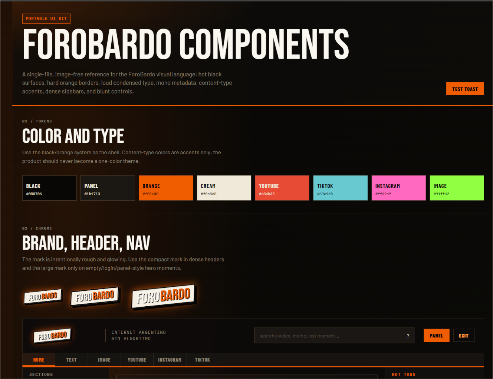
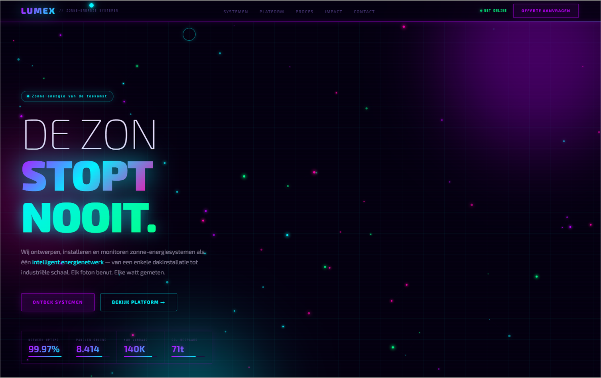
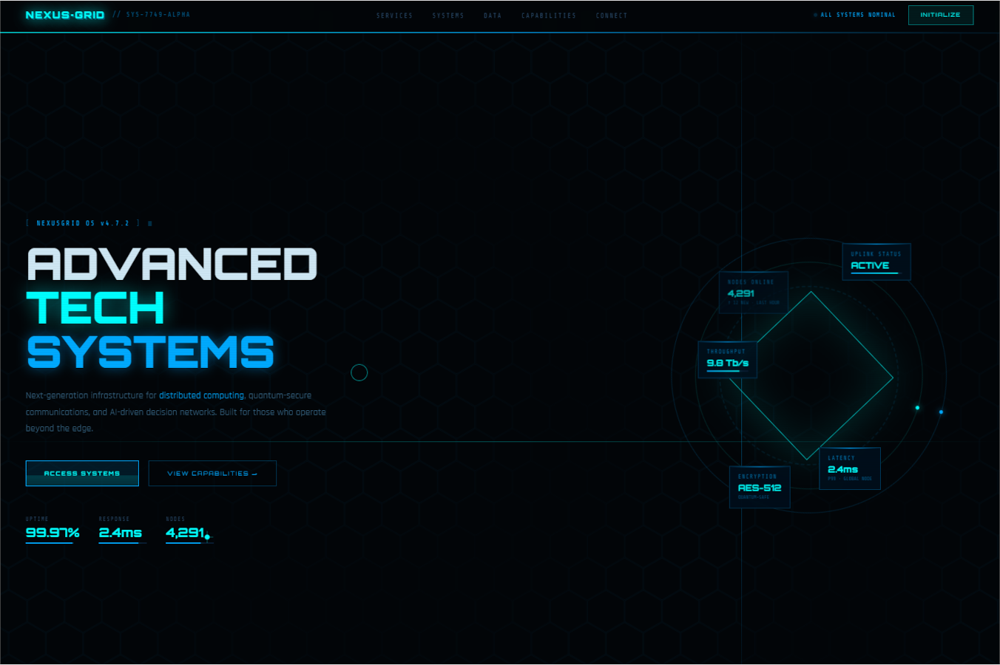
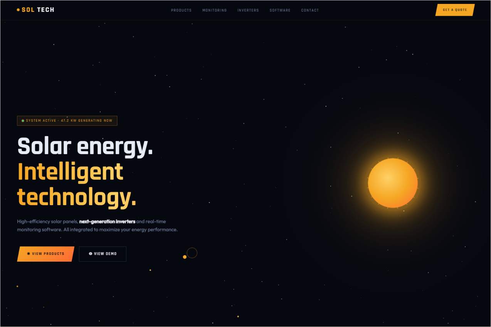
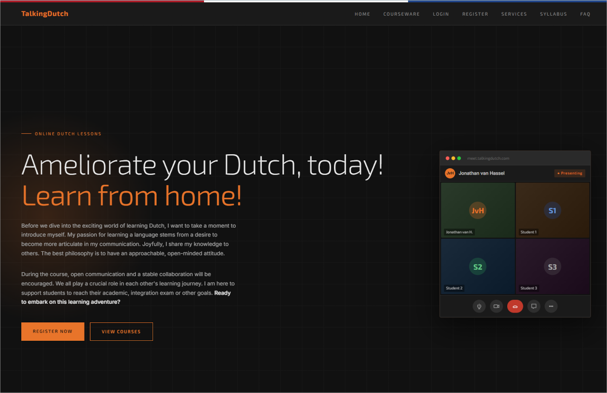
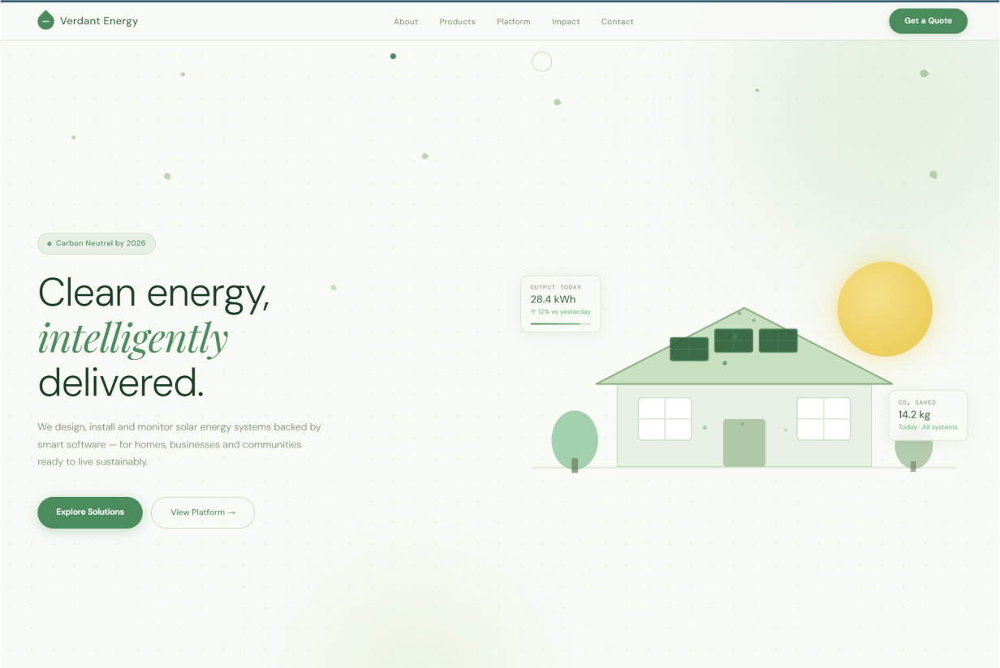

# Frontend Portfolio Aesthetic Store

A portable folder for storing and presenting reusable frontend aesthetics. Each card references a PNG preview in `assets/` using the same base name as its HTML file.

For maintenance, handoff, and AI-agent guidance, see [`AGENTS.md`](AGENTS.md).

When you prepare the preview images, save them with these names:

```text
assets/
  hrcomponent.png
  forum.png
  lumex.png
  nexusgrid.png
  soltech_english.png
  talkingdutch.png
  verdant.png
```

## Featured Component

### HR Component



**File:** `hrcomponent.html`  
**Type:** SaaS / HR platform component system  
**Feel:** clean, professional, friendly, information-dense without feeling heavy  
**Best for:** dashboards, internal tools, HR, CRM, admin panels, SaaS products  
**Visual signature:** light surfaces, periwinkle blue, sage, lavender, soft radii, compact components, tables, toasts, modals, tabs, filters, and loading states.

---

## Aesthetic Catalog

### ForoBardo



**File:** `forum.html`  
**Type:** Forum / community media platform component system  
**Feel:** loud, underground, opinionated, social, high-energy  
**Best for:** forums, creator communities, media feeds, social dashboards, content-heavy apps  
**Visual signature:** dark burnt surfaces, hot orange accents, condensed display type, mono metadata, chunky cards, post composers, media badges, modals, toasts, and forum-native interaction states.

---

### Lumex



**File:** `lumex.html`  
**Type:** Neon futurism / solar tech  
**Feel:** electric, nocturnal, energetic, premium tech  
**Best for:** energy, AI dashboards, crypto/fintech visuals, futuristic launches, motion-forward products  
**Visual signature:** dark background, neon purple/cyan, intense glow, particle canvas, marquee, luminous dashboards, and Exo 2 typography.

---

### NexusGrid



**File:** `nexusgrid.html`  
**Type:** Cyberpunk / high-tech infrastructure  
**Feel:** classified, technical, militarized, alive as a system  
**Best for:** cybersecurity, cloud infrastructure, AI ops, devtools, enterprise edge platforms  
**Visual signature:** blue/cyan palette, scanlines, glitch text, holograms, terminals, telemetry, and distributed-network visual language.

---

### SolTech



**File:** `soltech_english.html`  
**Type:** Solar tech / clean industry  
**Feel:** warm, optimistic, commercial, energetic  
**Best for:** renewable energy, climatetech, solar hardware, B2B/B2C landing pages  
**Visual signature:** orange/yellow solar palette, commercial layouts, product blocks, performance indicators, and clear CTAs.

---

### TalkingDutch



**File:** `talkingdutch.html`  
**Type:** Institutional learning / Dutch language school  
**Feel:** sober, direct, educational, local  
**Best for:** education, tutors, online academies, personal professional services  
**Visual signature:** institutional dark theme, orange accents, Dutch flag motifs, video-call mockup, simple cards, and clear editorial hierarchy.

---

### Verdant



**File:** `verdant.html`  
**Type:** Organic sustainability / solar product  
**Feel:** natural, lightweight, trustworthy, soft premium  
**Best for:** sustainability, clean energy, wellness tech, eco products, B Corps  
**Visual signature:** greens, mint, paper-like surfaces, organic blobs, leaf particles, eco dashboard, and DM Sans/Playfair typography.

---

## Usage Notes

- This directory is meant to be moved as a complete package into other projects.
- The HTML files are full demos; the images in `assets/` act as a quick visual storefront.
- When adding new aesthetics, keep the same pattern: `name.html` + `assets/name.png` + one catalog card in this README.
- Keep `AGENTS.md` updated when the repository purpose, naming conventions, or maintenance workflow changes.
